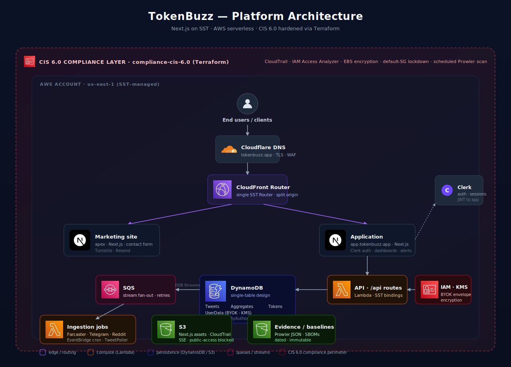

# TokenBuzz

> **Real-time crypto signal intelligence** — surfacing the tokens the market is *actually* talking about, the moment they start trending.

TokenBuzz turns the firehose of crypto social chatter (X, Farcaster, Telegram, Reddit) into ranked, queryable signal: spiking tokens, movers, watchlists, and AI-summarized context — delivered through a polished web application backed by a serverless AWS stack hardened against CIS 6.0.

---

## Architecture

  

A single Cloudflare-fronted CloudFront distribution routes traffic to two Next.js apps — the public marketing site at the apex and the authenticated application at `app.tokenbuzz.app`. Every backend component is serverless: Lambda for request handling and ingestion, DynamoDB for the single-table data model, SQS for stream fan-out, and S3 for assets and tamper-evident evidence. The entire AWS account sits inside a CIS 6.0 compliance perimeter enforced and continuously audited from a separate Terraform repository.

---

## Repositories

| Repository | What it is |
| --- | --- |
| [**`website`**](https://github.com/Token-Buzz/website) | The product. Next.js monorepo (marketing + application + shared core) deployed with [SST v4](https://sst.dev) on AWS. Contains all application code, infrastructure-as-code, background jobs, and CI/CD. |
| [**`compliance-cis-6.0`**](https://github.com/Token-Buzz/compliance-cis-6.0) | The guardrails. A Terraform project that enforces the CIS AWS Foundations Benchmark v6.0 against the production account — CloudTrail, IAM Access Analyzer, default-SG lockdown, password policy, account-level S3 block-public-access — plus a scheduled Prowler scan that produces dated, immutable evidence baselines. |

The two repos are tracked as a single program on a shared [GitHub Project board](https://github.com/orgs/Token-Buzz/projects/1) so security work and product work stay coordinated.

---

## Product surface

- **Movers & live feed** — a real-time view of which tokens are accelerating in social mentions, with drill-down to source posts.
- **Watchlists & dashboards** — saved cohorts of tokens with per-asset aggregates, sparklines, and alerts.
- **Hum** — an LLM slide-out that summarizes *why* a token is moving by reading the posts that drove the spike.
- **Alerts** — threshold and anomaly alerts on mention velocity, sentiment, and price.
- **Command palette (⌘K)** — instant search across tokens, watchlists, and queries.
- **Query history** — every Hum question is persisted, re-runnable, and shareable.
- **Multi-social ingestion** — X, Farcaster, Telegram, Reddit. Higher-cost providers are **BYOK** (bring-your-own-key): each user's API credentials are AES/KMS envelope-encrypted at rest in DynamoDB.

---

## Engineering posture

**Stack.** TypeScript end-to-end. Next.js 14 (App Router) for both marketing and application. [SST v4](https://sst.dev) defines all AWS resources in code — CloudFront, Lambda, DynamoDB, SQS, EventBridge, IAM — and deploys them via Pulumi. Clerk handles authentication. Cloudflare handles DNS, WAF, and Turnstile. Resend handles transactional email.

**Data.** DynamoDB single-table design across four tables (`Tweets`, `Aggregates`, `Tokens`, `UserData`) with named GSIs (`TopK`, `ByAuthor`, `SpikingByDelta`, `WatchlistByMentions`) tuned for the actual access patterns the product needs. Every access pattern is a typed key-builder; no inline `pk`/`sk` strings.

**Testing.** Three tiers: pure unit tests (offline), dynalite-backed integration tests that exercise the real DynamoDB client and GSI queries against an in-memory engine, and full browser UI tests via Playwright + Clerk's test harness — all running before AWS credentials are even configured in CI.

**Delivery.** GitHub Actions deploys via short-lived AWS credentials issued through OIDC — **no long-lived keys** stored anywhere. Every PR gets its own ephemeral preview stage (`pr-N.staging.tokenbuzz.app`) with its own CloudFront distribution and Clerk subdomain; closing the PR tears the stage down automatically. Production deploys on every merge to `master`. Release-please builds the changelog from Conventional Commits.

**Security & compliance.** The `compliance-cis-6.0` repo is the authority for account-wide controls; per-resource controls (CloudFront TLS, DynamoDB encryption, S3 bucket policies) stay with the SST resources that own them. A controls matrix maps every CIS v6.0 control to its owner and IaC file. Prowler runs on a schedule, drops dated JSON + HTML into an evidence bucket, and feeds a scorecard. The default Terraform deployment runs under **$1/month** by using free controls and EventBridge→SNS alerting in place of paid CloudWatch alarms — paid controls are toggleable when a customer needs them.

---

## Operating principles

- **Serverless by default.** No long-lived hosts means no OS patching, no autoscaling tuning, and a CIS scope that's compute-config-only.
- **One environment shape, many stages.** Production is just another stage; PR previews are real, deployed, end-to-end environments.
- **Least privilege everywhere.** OIDC for CI, fine-grained PATs for GitHub access, per-user KMS-encrypted credentials for third-party APIs, no project-wide social keys.
- **Cost-aware compliance.** Compensating controls (scheduled Prowler + `terraform plan` drift) cover gaps where paid AWS services would otherwise be required, with a clear upgrade path.
- **Evidence is a deliverable.** Every scheduled scan produces a dated, immutable artifact — not a dashboard screenshot.

---

## Contact

Interested in a deeper walkthrough, a live demo, or a copy of the controls matrix and a recent Prowler baseline? Reach out through the contact form on [tokenbuzz.app](https://tokenbuzz.app) or open an issue against either repository.
